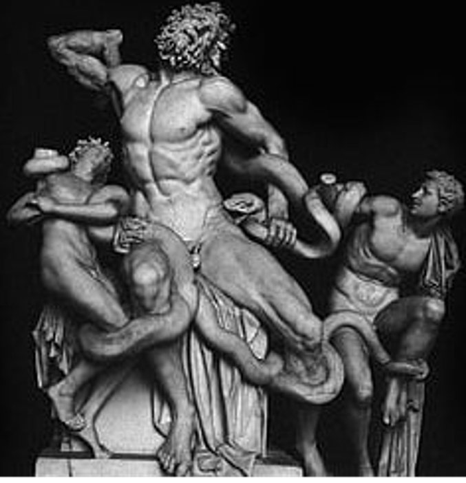
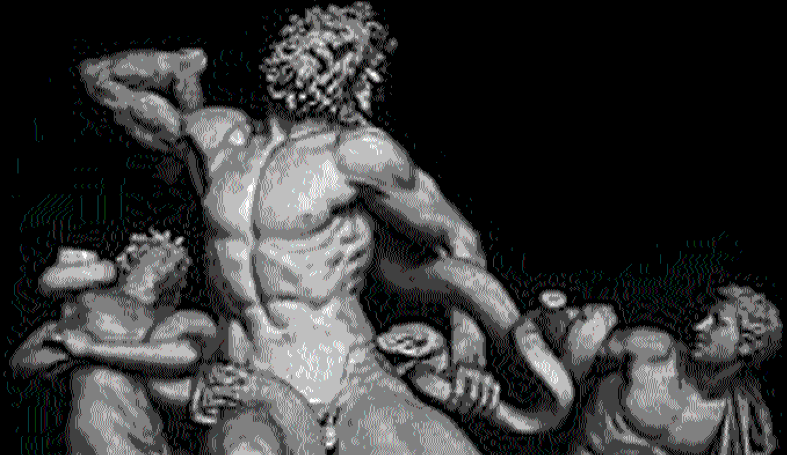
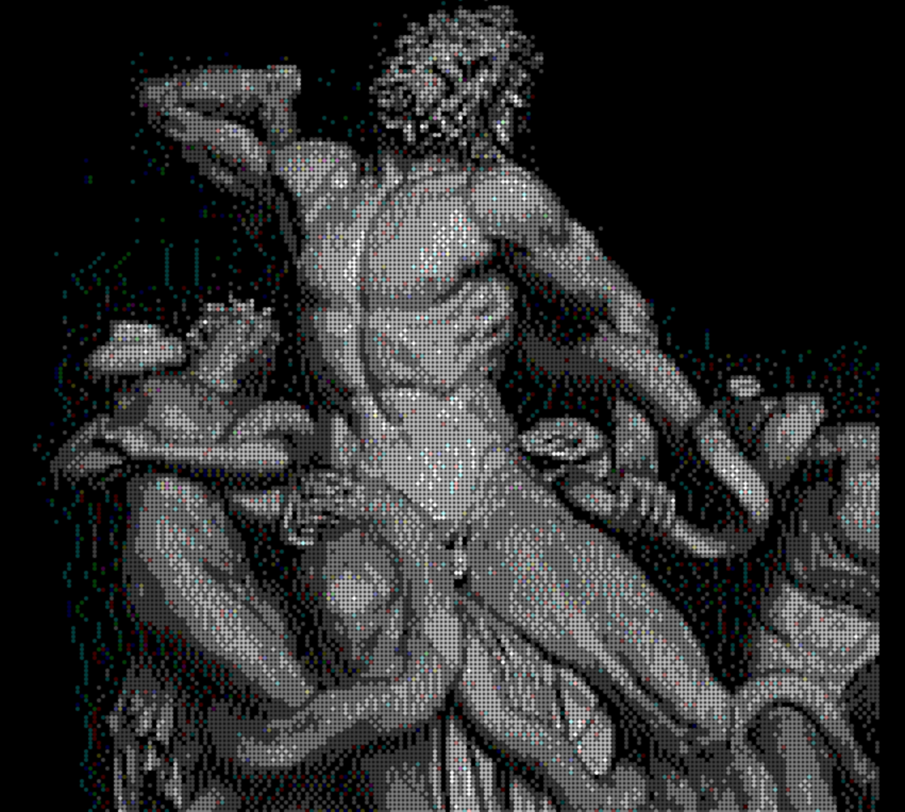
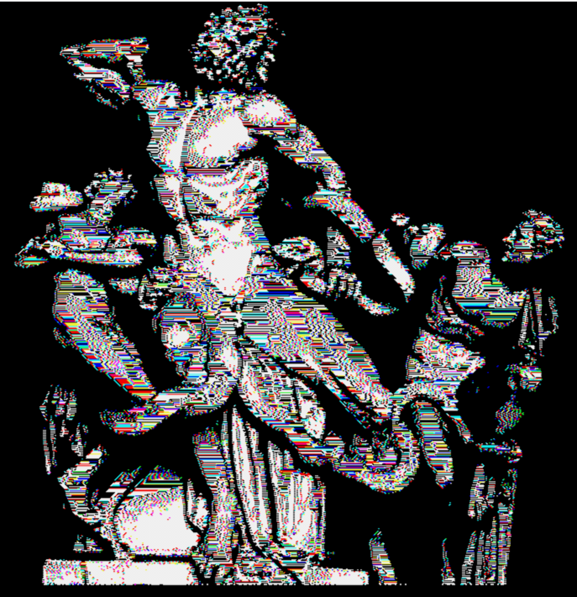
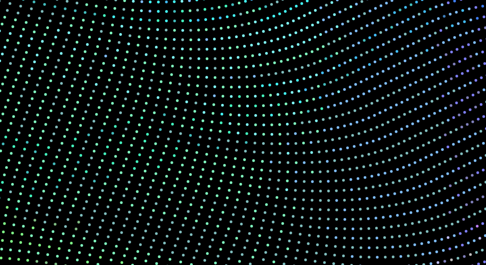
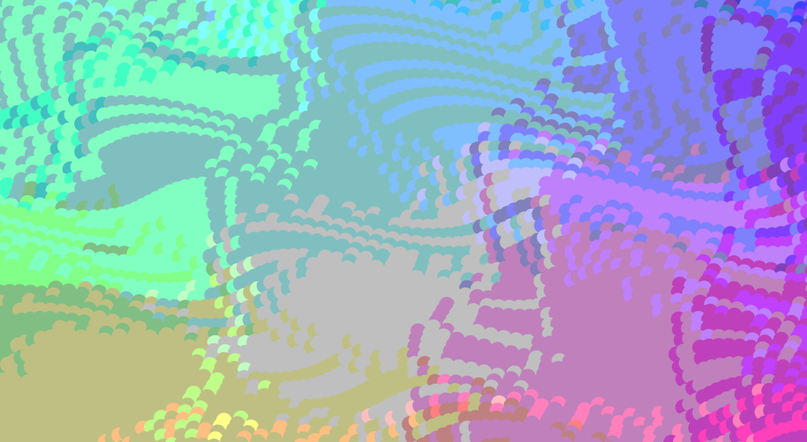

# Floyd-Steinberg Dithering Wave Effects
Floyd-Steinberg Dithering implementation with optional wave effects
https://en.wikipedia.org/wiki/Floyd%E2%80%93Steinberg_dithering

To Dither your own image, add it to the /Images folder and set backgroundImage to "backgroundImage.src = 'Images/YOURIMAGE.png';" you may need to readjust cell size and spacing to fit your image to the canvas.
To add wave effects to the dithered image, replace the constant variables on lines 75-79 of index.js with the preset settings.
To change the number of color possibilities accepted within error, ie. how many color variations you want your cells to have, chenage the ColorFactor on line 85 of index.js

You may need to refresh the page.

------------------------------------------
**Dithering Example:**

 
(Undithered Image)

 
(Dithered Image: Square Cells)

 
(Dithered Image: Circlular Cells)

------------------------------------------
**Color Factor Example:**

 
(Dithered Image: Color Factor of 1)

------------------------------------------
**Wave Example:**

 
(Wave1 preset: backgroundImage.src = 'Images/colors.png' )

 
(Wave8 preset: backgroundImage.src = 'Images/colors.png', ColorFactor = 4)

 
(Wave8 preset: backgroundImage.src = 'Images/colors.png', ColorFactor = 64)
